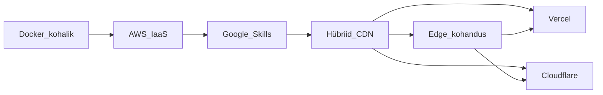

# PILVETEENUSED: majutuse harjutamise ressursid

**Laenutus** rakenduse (PHP + MySQL monoliit) pilvemajutuse harjutamiseks

Soovitus proovida neid:

**Docker (kohalik) → AWS Educate → Google Skills → Vercel → Cloudflare**

---

## Sisukord

1. [Rakenduse nõuded](#1-rakenduse-nõuded)
2. [Kohalik baas (null-samm)](#2-kohalik-baas-null-samm)
3. [Platvormide võrdlus](#3-platvormide-võrdlus)
4. [AWS Educate ja AWS Builder Center](#4-aws-educate-ja-aws-builder-center)
5. [Google Cloud ja Google Skills Boost](#5-google-cloud-ja-google-skills-boost)
6. [Vercel (kaks rada)](#6-vercel-kaks-rada)
7. [Cloudflare (kaks rada)](#7-cloudflare-kaks-rada)
8. [Lisa-ressursid ja varuplatvormid](#8-lisa-ressursid-ja-varuplatvormid)
9. [Praktilised juhendid](#9-praktilised-juhendid)
10. [Tüüpilised vead](#10-tüüpilised-vead)
11. [Hindamine](#11-hindamissoovitused-õppejõule)
12. [Kogumik linke](#12-linkide-register)

---

## 1. Rakenduse nõuded

Laenutus on PHP monoliit, mis vajab juurutamisel järgmist:

| Nõue | Detail | Projektifail |
|------|--------|--------------|
| PHP | 8.2+ | `Dockerfile` |
| Veebiserver | Apache + `mod_rewrite` | `Dockerfile`, `public/.htaccess` |
| Document root | `public/` kaust | `Dockerfile` (`APACHE_DOCUMENT_ROOT`) |
| Andmebaas | MySQL 8 | `sql/schema.sql`, `sql/seed.sql` |
| Composer | `firebase/php-jwt` jms | `composer.json` |
| Keskkonnamuutujad | `DB_*`, `JWT_SECRET` | `.env.example` |
| Konteinerid | app + db | `docker-compose.yml` |

### Juurutamise kontrollnimekiri (enne esitamist)

- [ ] `GET /health` tagastab HTTP 200
- [ ] Sisselogimine töötab (`student@kool.ee` / `student123`)
- [ ] Laenutuste loend laadib andmebaasist
- [ ] Uue laenutuse loomine töötab
- [ ] HTTPS on kasutusel (või selgitatud, miks mitte)
- [ ] `.env` fail **ei ole** Gitis
- [ ] MySQL port 3306 **ei ole** avalikult internetis avatud
- [ ] `JWT_SECRET` on unikaalne (mitte vaikimisi väärtus)

### Plaan



**Oluline:** Vercel ja Cloudflare on **edge/serverless** platvormid. PHP + MySQL monoliiti ei saa sinna otse paigutada samamoodi nagu AWS EC2-le. Sellepärast on kaks rada: **hübriid** (soovitatav) ja **kohandus** (edasijõudnutele).

---

## 2. Kohalik baas (null-samm)

Enne pilve minekut veendu, et rakendus töötab kohalikult.

```bash
cp .env.example .env
docker compose up --build
```

Ava brauseris: http://localhost:8080

### Mida testida enne pilve

```bash
# Tervisekontroll
curl -i http://localhost:8080/health

# Sisselogimine
curl -s -X POST http://localhost:8080/auth/login \
  -H 'Content-Type: application/json' \
  -d '{"email":"student@kool.ee","password":"student123"}'

# Laenutuste loend (asenda TOKEN)
curl -i http://localhost:8080/loans -H "Authorization: Bearer TOKEN"
```

Kui kohalik ei tööta, ära mine pilve — paranda enne vead.

---

## 3. Platvormide võrdlus

| Platvorm | Tasuta / haridus | PHP | MySQL | Docker | Krediitkaart | Sobib Laenutusele | Märkused |
|----------|------------------|-----|-------|--------|--------------|-------------------|----------|
| **AWS Educate** | Kuni ~$100 krediiti, lab-id | Jah (EC2/EB) | Jah (RDS) | Jah (ECS) | Ei (Starter Account) | **Suurepärane** | Starter Account piirangud |
| **AWS Builder Center Students** | Skill Builder Premium 12 kk, kuni $30 krediiti | Jah | Jah | Jah | Ei (lab sandbox) | **Suurepärane** | SheerID verifitseerimine |
| **Google Skills Boost** | 200 lab-krediiti (taotlus) | Jah (GCE) | Jah (Cloud SQL) | Jah (GKE/Cloud Run) | Ei (labid) | **Suurepärane** | Kuni 2 nädala ooteaeg |
| **Azure for Students** | $100 / 12 kuud | Jah (VM/App Service) | Jah (Azure Database) | Jah | Ei | **Hea** | Uuenda iga aasta |
| **Oracle Cloud Always Free** | Alati tasuta ARM VM | Jah (ise installid) | Jah (Autonomous DB) | Jah | Verifitseerimine | **Hea** | Konto loomine võib võtta aega |
| **Oracle Academy** | Akadeemiline ligipääs | Jah | Jah | Jah | Ei | **Hea** | Vajab instituudi liikmelisust |
| **Vercel Hobby** | Tasuta (mitteäriline) | Piiratud (serverless) | Ei (väline DB) | Ei | Ei | **Osaliselt** | Rada A või B |
| **Cloudflare Free** | Tasuta plaan | Ei (Workers PHP eraldi) | Ei (D1/Hyperdrive) | Ei | Ei | **Osaliselt** | CDN/DNS + Rada B |
| **Cloudflare Students** | 12 kk Workers Paid | Piiratud | Hyperdrive | Ei | Jah (billing) | **Osaliselt** | Ainult USA `.edu` |
| **InfinityFree / GoogieHost** | Alati tasuta shared | Jah 8.x | Jah | Ei | Ei | **Hea kiireks testiks** | Piiratud SSH/Composer |
| **Render / Railway** | Piiratud tasuta tier | Jah (Docker) | Jah (addon) | Jah | Võib vaja minna | **Hea alternatiiv** | Magab pärast idle |

---

## 4. AWS Educate ja AWS Builder Center

AWS on esimene soovituslik platvorm täis PHP + MySQL monoliidi juurutamiseks.

### Registreerumine ja krediidid

| Programm | Link | Mida saad |
|----------|------|-----------|
| AWS Educate | https://aws.amazon.com/education/awseducate/ | Starter Account, lab-id, kuni ~$100 krediiti, digitaalsed märgid |
| AWS Builder Center – Students | https://builder.aws.com/learn/students | SheerID verifitseerimine → 12 kuud Skill Builder Premium |
| AWS Skill Builder | https://skillbuilder.aws/ | 900+ kursust, hands-on lab-id sandboxis (krediitkaart pole vaja) |

**AWS Builder Center Student Rewards (2025–2026):**

| Samm | Tasu |
|------|------|
| Verifitseeritud üliõpilane + profiil täidetud | 12 kuud Skill Builder Premium (~$449 väärtuses) |
| 7 märki (badges) | $10 AWS krediiti |
| 14 märki | $20 AWS krediiti |
| 21 märki | AWS Foundational Certification voucher ($100) |

**Eesti kontekst:** AWS Educate ja Builder Center töötavad Eesti ülikoolide üliõpilastega SheerID või kooli e-maili kaudu.

### Soovitatavad AWS teenused Laenutuse jaoks

| Teenus | Kasutus | Hind (ligikaudu) | Keerukus |
|--------|---------|------------------|----------|
| **Amazon Lightsail** | Lihtsaim VM, fikseeritud hind | $3.50–5/kuu (90-päevane proov) | Madal |
| **EC2 + RDS** | Klassikaline IaaS + managed DB | ~$15–30/kuu (t2.micro free tier) | Keskmine |
| **Elastic Beanstalk** | PHP platvorm ilma Dockerita | Sama mis EC2 taustal | Keskmine |
| **ECS/Fargate** | Docker Compose juurutamine | Kallim | Kõrge |

### Skill Builder lab-id (otsingusõnad)

Otsi Skill Builderist või Workshop Studio'st:

- `Launch a virtual machine with Amazon EC2`
- `Create a MySQL DB instance with Amazon RDS`
- `Introduction to Amazon Lightsail`
- `Deploy a containerized web application on Amazon ECS`
- `Introduction to AWS CloudFormation`
- `Set up a billing alarm`

Tasuta lab-id kasutavad **sandbox keskkonda** — seal ei teki päris arveid.

### Laenutuse juurutamine AWS-s: EC2 + RDS

#### Samm 1: RDS MySQL andmebaas

1. AWS Console → RDS → Create database
2. Engine: **MySQL 8.0**
3. Template: Free tier (kui saadaval) või Dev/Test
4. DB instance identifier: `laenutus-db`
5. Master username / password: salvesta turvaliselt
6. Public access: **No** (soovitatav) või Yes ainult harjutuse ajaks
7. VPC security group: loo uus, luba port **3306** ainult EC2 security groupist

#### Samm 2: Impordi skeem ja seed

Kui RDS on valmis, impordi andmed (kohalikult või EC2-lt):

```bash
mysql -h laenutus-db.xxxxx.eu-north-1.rds.amazonaws.com \
  -u admin -p laenutus < sql/schema.sql

mysql -h laenutus-db.xxxxx.eu-north-1.rds.amazonaws.com \
  -u admin -p laenutus < sql/seed.sql
```

Alternatiiv: kasuta MySQL Workbench või DBeaver GUI-ga.

#### Samm 3: EC2 virtuaalmasin

1. AMI: **Ubuntu 24.04 LTS**
2. Instance type: **t2.micro** (free tier) või t3.small
3. Key pair: loo `.pem` fail (hoia turvaliselt!)
4. Security Group:
   - SSH (22) — ainult sinu IP
   - HTTP (80) — 0.0.0.0/0
   - HTTPS (443) — 0.0.0.0/0
   - MySQL (3306) — **ÄRA lisa avalikult!**

#### Samm 4: Paigalda Docker EC2-le

```bash
# Ühenda SSH-ga
ssh -i võti.pem ubuntu@EC2_PUBLIC_IP

# Paigalda Docker
sudo apt update && sudo apt install -y docker.io docker-compose-v2 git
sudo usermod -aG docker ubuntu
# Logi välja ja tagasi sisse

# Klooni projekt
git clone <sinu-repo-url> laenutus
cd laenutus
```

#### Samm 5: Seadista `.env` produktsiooniks

```bash
cp .env.example .env
nano .env
```

Produktsiooni `.env` näide:

```env
APP_NAME=Laenutus
APP_ENV=production
JWT_SECRET=<genereeri-tugev-juhuslik-string-min-32-tähemärki>

DB_HOST=laenutus-db.xxxxx.eu-north-1.rds.amazonaws.com
DB_PORT=3306
DB_NAME=laenutus
DB_USER=admin
DB_PASSWORD=<rds-parool>
```

**Genereeri JWT_SECRET:**

```bash
openssl rand -base64 32
```

#### Samm 6: Kohanda docker-compose.yml pilve jaoks

Kui kasutad RDS-i (mitte konteineris olevat db teenust), eemalda `db` teenus compose failist või kasuta override faili:

```yaml
# docker-compose.prod.yml
services:
  app:
    build: .
    ports:
      - "80:80"
    env_file:
      - .env
    # Ei vaja db teenust — RDS on eraldi
```

```bash
docker compose -f docker-compose.yml -f docker-compose.prod.yml up --build -d
```

#### Samm 7: DNS ja HTTPS (valikuline)

- **Elastic IP** — fikseeritud avalik IP EC2-le
- **Route 53** — oma domeen → Elastic IP
- **Let's Encrypt** — certbot Apache jaoks:

```bash
sudo apt install certbot python3-certbot-apache
sudo certbot --apache -d laenutus.sinudomeen.ee
```

### Alternatiiv: Amazon Lightsail (lihtsam)

1. Lightsail → Create instance → Linux, $3.50 plan
2. Install application: **LAMP (PHP 8)** või Docker blueprint
3. Database → Create database (MySQL)
4. Impordi `schema.sql` + `seed.sql`
5. Laadi projekt üles SFTP/SSH kaudu
6. Seadista `.env` ja Apache document root → `public/`

Lightsail lihtsustab security group'e ja DNS-i — hea esimeseks AWS kogemuseks.

### Alternatiiv: Elastic Beanstalk (PHP ilma Dockerita)

1. Loo ZIP: projekt + `vendor/` (käivita `composer install` enne)
2. Beanstalk → Create environment → Web server → PHP 8.2
3. Lisa RDS MySQL andmebaas environment configurationis
4. Seadista keskkonnamuutujad Beanstalk Configuration → Software
5. Document root: `/public`

**Tähelepanek:** Beanstalk ei kasuta sinu `Dockerfile`-i — see on eraldi juurutusviis.

### AWS harjutusülesanded

#### Ülesanne 1: Avalik tervisekontroll

**Eesmärk:** Rakendus vastab internetist.

**Sammud:**
1. Juuruta Laenutus EC2-le
2. Ava brauseris `http://EC2_IP/health`
3. Veendu, et vastus on JSON `{"status":"ok"}`

**Esitamine:** Screenshot + curl väljund.

**Hindamisvihje:** HTTP 200, mitte 502/404.

---

#### Ülesanne 2: RDS ühendus ja andmebaasi migratsioon

**Eesmärk:** Rakendus loeb andmeid RDS-ist, mitte lokaalsest MySQL konteinerist.

**Sammud:**
1. Loo RDS MySQL 8.0
2. Impordi `sql/schema.sql` ja `sql/seed.sql`
3. Seadista `.env` DB_HOST → RDS endpoint
4. Logi sisse rakendusse, vaata laenutuste loendit

**Esitamine:** Screenshot laenutuste lehest + RDS endpoint (parool peidetud).

**Hindamisvihje:** Andmed tulevad RDS-ist (kustuta üks rida RDS-is, kontrolli et UI muutub).

---

#### Ülesanne 3: Security Group audit

**Eesmärk:** Mõista pilve turvalisuse põhitõdesid.

**Kontrolli:**
- [ ] Port 22 (SSH) on avatud ainult sinu IP-le (mitte 0.0.0.0/0)
- [ ] Port 3306 (MySQL) **ei ole** avalikult avatud
- [ ] Port 80/443 on avatud veebiliiklusele
- [ ] `.env` fail ei ole GitHubis

**Esitamine:** Screenshot EC2 Security Group reeglitest + lühike selgitus.

**Hindamisvihje:** 0 punkte, kui port 3306 on avalik.

---

#### Ülesanne 4: Kulude kontroll

**Eesmärk:** Õpi pilvekulusid haldama.

**Sammud:**
1. Seadista Billing Alarm ($5 või $10 künnis)
2. Peale harjutust: **Stop** EC2 (mitte Terminate, kui tahad hiljem jätkata)
3. Kustuta RDS (kui enam ei vaja) — RDS maksab ka peatatud EC2 korral!
4. Vaata Cost Explorer → Daily costs

**Esitamine:** Screenshot billing alarmist + lühike kokkuvõte kuludest.

**Hindamisvihje:** RDS unustamine = kallis üllatus.

---

#### Ülesanne 5: Juurutusraport

**Eesmärk:** Dokumenteeri oma juurutus.

**Esita 1-leheküljeline raport:**
- Avalik URL
- Kasutatud AWS teenused (EC2, RDS, jne)
- Regioon (nt eu-north-1)
- `.env` muutujate nimekiri (väärtusteta!)
- Tekkinud probleemid ja lahendused
- Hinnanguline kuukulu

### AWS kulude ja turvalisuse vihjed

- **Billing Alarm** esimesel päeval — AWS Console → Billing → Budgets
- **Stop vs Terminate:** Stop säästab EBS ketast; Terminate kustutab kõik
- **RDS maksab 24/7** — kustuta, kui harjutus on läbi
- **Free tier** kehtib 12 kuud uue konto puhul (EC2 t2.micro 750h/kuu)
- **Regioon:** vali `eu-north-1` (Stockholm) — lähemal Eestile
- **`.env` ja `.pem` failid** — ära commiti Giti, lisa `.gitignore`-i

---

## 5. Google Cloud ja Google Skills Boost

Teine soovituslik platvorm — sarnane AWS-iga, aga Google'i ökosüsteemis.

### Registreerumine ja krediidid

| Programm | Link | Mida saad |
|----------|------|-----------|
| Google Skills Boost | https://www.cloudskillsboost.google/ | Lab-kataloog, skill badges |
| Student Training Credits | https://services.google.com/fb/forms/googlecloudskillsbooststudenttrainingcreditsapplication/ | 200 lab-krediiti (kehtib 1 aasta) |
| Faculty GCP Credits | https://cloud.google.com/billing/docs/how-to/edu-grants | Õppejõud saab jagada kursuse kaudu |

**Taotluse protsess:**
1. Täida vorm üliõpilase andmetega
2. Oota kuni 2 nädalat
3. Krediit ilmub Skills Boost konto → Settings → Subscriptions

**Eesti kontekst:** Google Skills krediidid on saadaval akrediteeritud kõrgkoolide üliõpilastele.

### Soovitatavad lab-id (Skills Boost / Qwiklabs)

Otsi kataloogist:

- `Create a Virtual Machine` (Compute Engine)
- `Cloud SQL for MySQL: Qwik Start`
- `Set up a Cloud Network and Deploy a Web Server`
- `Deploy a Containerized Web Application on Google Kubernetes Engine` (edasijõudnutele)
- `Cloud Run: Qwik Start` + Cloud SQL ühendus
- `Getting Started with Cloud Shell & gcloud`

Paljud lab-id kasutavad ajutist projekti — **päris arveid ei teki**.

### Laenutuse juurutamine GCP-s: Compute Engine + Cloud SQL

#### Samm 1: Cloud SQL MySQL

1. Console → SQL → Create Instance → MySQL 8.0
2. Instance ID: `laenutus-db`
3. Password: salvesta turvaliselt
4. Region: `europe-north1` (Hamina, Soome — lähim Eestile)
5. Machine type: Shared core (odavaim)
6. Connections → Public IP (harjutuse jaoks) + Authorized networks (sinu IP)

#### Samm 2: Impordi skeem

```bash
# Cloud Shell-is või kohalikult (Cloud SQL Auth Proxy-ga)
gcloud sql connect laenutus-db --user=root --quiet

# MySQL promptis:
source sql/schema.sql;
source sql/seed.sql;
```

Või:

```bash
mysql -h CLOUD_SQL_IP -u root -p < sql/schema.sql
mysql -h CLOUD_SQL_IP -u root -p < sql/seed.sql
```

#### Samm 3: Compute Engine VM

1. Compute Engine → VM instances → Create
2. Machine type: e2-micro (Always Free eligible)
3. Boot disk: Ubuntu 24.04 LTS, 10 GB
4. Firewall: luba HTTP ja HTTPS traffic
5. Network tags: `http-server`, `https-server`

#### Samm 4: Paigalda ja käivita

Sama protsess nagu AWS EC2 puhul:

```bash
ssh -i ~/.ssh/google_compute_engine USER@EXTERNAL_IP

sudo apt update && sudo apt install -y docker.io docker-compose-v2 git
git clone <repo> laenutus && cd laenutus
cp .env.example .env
# Muuda .env: DB_HOST → Cloud SQL IP, JWT_SECRET → uus
docker compose up --build -d
```

#### Samm 5: VPC Firewall

Veendu, et Cloud SQL port 3306 on avatud ainult VM-i sisemise IP jaoks:

1. VPC Network → Firewall → Create rule
2. Direction: Ingress, Targets: Cloud SQL, Source: VM internal IP
3. Ports: tcp:3306

### Alternatiiv: Cloud Run + Cloud SQL

Edasijõudnutele — serverless konteiner:

1. Build Docker image → push to Artifact Registry
2. Cloud Run → Deploy container
3. Cloud SQL → Add connection (Unix socket)
4. Set env vars in Cloud Run service

See kasutab sinu `Dockerfile`-i otse, aga nõuab Cloud SQL Auth Proxy seadistamist.

### Google Cloud harjutusülesanded

#### Ülesanne 1: Compute Engine + avalik veeb

**Eesmärk:** Sama mis AWS ülesanne 1, aga GCP-s.

**Esitamine:** URL + screenshot `/health` vastusest.

---

#### Ülesanne 2: Cloud SQL migratsioon

**Eesmärk:** Andmebaas Cloud SQL-is, mitte VM-il.

**Esitamine:** Screenshot Cloud SQL instancist + rakenduse laenutuste leht.

---

#### Ülesanne 3: IAM ja turvalisus

**Eesmärk:** Mõista GCP IAM-i.

**Kontrolli:**
- [ ] VM-i teenusekonto ei ole Owner
- [ ] Cloud SQL ei ole avalikult ilma IP piiranguta
- [ ] `.env` ei ole Gitis
- [ ] Firewall reeglid on minimaalsed

**Esitamine:** Screenshot IAM rollidest + firewall reeglitest.

---

#### Ülesanne 4: Billing alert

**Eesmärk:** GCP kulude jälgimine.

**Sammud:**
1. Billing → Budgets & alerts → Create budget ($5)
2. Peale harjutust: Stop VM, delete Cloud SQL instance
3. Vaata Billing → Reports

**Esitamine:** Screenshot budget alertist.

---

#### Ülesanne 5: gcloud CLI harjutus

**Eesmärk:** Õpi käsurea tööriistu.

**Sammud:**
```bash
gcloud compute instances list
gcloud sql instances list
gcloud compute ssh INSTANCE_NAME
```

**Esitamine:** Terminali screenshot kolmest käsust koos väljundiga.

### Google Cloud vihjed

- **e2-micro** on Always Free (1 instants regioonis `us-west1`, `us-central1`, `us-east1` — mitte `europe-north1`!)
- **Cloud SQL** on kallim kui RDS — kustuta kohe peale harjutust
- **Cloud Shell** on tasuta brauseripõhine terminal — hea kiireks testiks
- **Skills Boost lab-id** ei kasuta sinu GCP projekti krediiti

---

## 6. Vercel (kaks rada)

Vercel on **frontend/serverless** platvorm. PHP + MySQL monoliiti ei saa sinna otse paigutada nagu AWS EC2-le. Sellepärast kaks rada.

### Rada A: Hübriid (soovitatav enamikule)

**Idee:** Monoliit jääb AWS/GCP VM-ile. Vercelit kasutad Git-põhise juurutuse, keskkonnamuutujate ja serverless vs traditsioonilise arhitektuuri **mõistmiseks**.

#### Mida Vercel-is teha

1. **Staatic landing page** — loo lihtne HTML/CSS leht, mis suunab kasutaja monoliidi URL-ile
2. **Dokumentatsiooni sait** — projekti README-st genereeritud statiline leht
3. **Git-põhine deploy workflow** — harjuta CI/CD kontseptsiooni

#### Näide: staatic redirect leht

```html
<!-- index.html Vercel projektis -->
<!DOCTYPE html>
<html lang="et">
<head>
  <meta charset="UTF-8">
  <title>Laenutus</title>
  <meta http-equiv="refresh" content="0;url=https://laenutus.sinu-aws-ip.ee">
</head>
<body>
  <p>Suuname <a href="https://laenutus.sinu-aws-ip.ee">Laenutuse</a> juurde...</p>
</body>
</html>
```

#### Vercel seadistamine

1. Loo konto: https://vercel.com/signup
2. Import GitHub repo (või loo uus repo ainult landing page'iga)
3. Deploy → automaatne HTTPS
4. Custom domain (valikuline)

#### Mida õpid

- Git push → automaatne deploy
- Keskkonnamuutujad (Settings → Environment Variables)
- Serverless vs traditsiooniline server (võrdlus monoliidiga)
- Hobby plan piirangud (100 GB bandwidth, 10s function timeout)

### Rada B: Kohandus (edasijõudnud)

**Idee:** Paiguta PHP serverless funktsioonidena Vercel-isse, MySQL välises teenuses.

#### Piirangud (oluline!)

| Piirang | Hobby plan | Mõju Laenutusele |
|---------|------------|------------------|
| Function timeout | 10 sekundit | Pikad päringud katkevad |
| Stateless | Jah | Ei püsivat sessiooni/serverit |
| File system | Kirjutamine ei püsi | Uploadid ei tööta |
| MySQL | Pole sisseehitatud | Vajab välist DB (RDS, PlanetScale) |
| Commercial use | Keelatud | Ainult õppimiseks |

#### vercel-php runtime

- GitHub: https://github.com/vercel-community/php
- PHP 8.5 serverless functions
- Laiendused: pdo_mysql, mysqli, curl, json jne

#### vercel.json näide

```json
{
  "functions": {
    "api/**/*.php": {
      "runtime": "vercel-php@0.7.4"
    }
  },
  "routes": [
    { "src": "/health", "dest": "/api/health.php" },
    { "src": "/auth/login", "dest": "/api/auth/login.php", "methods": ["POST"] },
    { "src": "/(.*)", "dest": "/api/index.php" }
  ]
}
```

**Hoiatus:** Laenutuse monoliit vajab märkimisväärset ümberkorraldamist (router, views, DB connection) serverless mudelile. See on **edasijõudnute valikuline ülesanne**, mitte nõue.

#### Väline MySQL Vercel-ile

| Teenus | Tasuta tier | Märkused |
|--------|-------------|----------|
| AWS RDS | Free tier 12 kk | Juba olemas AWS harjutusest |
| PlanetScale | 5 GB tasuta | MySQL-ühilduv, serverless |
| Neon | Tasuta tier | PostgreSQL (vajab SQL-i muutmist) |

### Vercel ressursid

| Ressurss | Link |
|----------|------|
| Hobby plan piirangud | https://vercel.com/docs/plans/hobby |
| Environment variables | https://vercel.com/docs/projects/environment-variables |
| Serverless Functions | https://vercel.com/docs/functions |
| vercel-php runtime | https://github.com/vercel-community/php |
| Deploy hooks | https://vercel.com/docs/deploy-hooks |

### Vercel harjutusülesanded

#### Ülesanne A1: Staatic landing page

**Eesmärk:** Deploy Git-ist Vercel-isse.

**Sammud:**
1. Loo repo `laenutus-landing` (HTML + CSS)
2. Ühenda Vercel-iga
3. Deploy → saad `*.vercel.app` URL

**Esitamine:** Vercel URL + screenshot deploy logist.

---

#### Ülesanne A2: Keskkonnamuutujad

**Eesmärk:** Mõista env vars konseptsiooni.

**Sammud:**
1. Lisa Vercel projekti env var: `API_URL=https://sinu-aws-ip/health`
2. Loo lihtne JS fail, mis fetchib `API_URL` ja kuvab tulemust landing page'il

**Esitamine:** Screenshot env vars seadistusest + brauseris API vastus.

---

#### Ülesanne B1: PHP health endpoint serverless-na (edasijõudnud)

**Eesmärk:** Deploy üks PHP fail Vercel function-ina.

**Sammud:**
1. Loo `api/health.php`:

```php
<?php
header('Content-Type: application/json');
echo json_encode(['status' => 'ok', 'platform' => 'vercel']);
```

2. Lisa `vercel.json` (vt näide üleval)
3. Deploy ja testi `https://projekt.vercel.app/health`

**Esitamine:** curl väljund Vercel URL-ilt.

---

## 7. Cloudflare (kaks rada)

Cloudflare pakub CDN-d, DNS-i, turvalisust ja edge computingut (Workers). Nagu Vercel, ei hosti see otse PHP + MySQL monoliiti.

### Rada A: Hübriid (soovitatav enamikule)

**Idee:** Monoliit jääb AWS/GCP-s. Cloudflare ees — DNS, SSL, CDN cache, turvalisus.

#### Mida Cloudflare-is seadistada

1. **DNS** — suuna domeen → origin server (AWS/GCP IP)
2. **SSL/TLS** — Full (strict) režiim
3. **Caching** — cache staatilised failid (`public/assets/css/`, `public/assets/js/`)
4. **Security** — WAF, Bot Fight Mode, Rate Limiting (tasuta plaanil piiratud)

#### Samm-sammult DNS seadistus

1. Loo Cloudflare konto: https://dash.cloudflare.com/sign-up
2. Add site → sisesta oma domeen (või kasuta Cloudflare'i tasuta `*.workers.dev` / `*.pages.dev` harjutuseks)
3. Muuda nameservereid registripidaja juures (või kasuta CNAME setup)
4. DNS → Add record:
   - Type: **A**
   - Name: `@` või `laenutus`
   - Content: AWS/GCP VM IP
   - Proxy status: **Proxied** (oranž pilv)
5. SSL/TLS → Overview → **Full (strict)**
6. Edge Certificates → Always Use HTTPS: **On**

#### Cache reeglid staatiliste failide jaoks

Page Rules (või Cache Rules):

```
URL: *sinudomeen.ee/assets/*
Setting: Cache Level = Cache Everything, Edge Cache TTL = 1 month
```

Või Cache Rules (uus):

```
If URI Path contains "/assets/"
Then: Cache eligibility = Eligible, Edge TTL = 1 month
```

#### Mida õpid

- DNS propagation ja nameserverid
- Reverse proxy kontseptsioon (Cloudflare ↔ origin)
- SSL termination (Cloudflare ↔ kasutaja HTTPS, Cloudflare ↔ origin HTTPS)
- CDN cache (miks CSS laadib kiiremini teisel korral)
- Turvalisus (DDoS kaitse, WAF põhitõed)

### Rada B: Edge (edasijõudnud)

**Idee:** Cloudflare Workers, Pages, Hyperdrive — serverless edge computing.

#### Cloudflare Pages

- Staatic saitide deploy Git-ist
- Pages Functions — JavaScript/TypeScript serverless
- **Ei toeta PHP-d otse**

#### Cloudflare Workers

- JavaScript/TypeScript edge functions
- **Workers PHP** (WASM): https://workersphp.dev/ — PHP 8.5 Laravel edge-is
- **Hyperdrive** — MySQL ühenduse pool connection origin serveri asemel

#### Workers proxy näide (health endpoint)

```javascript
// worker.js
export default {
  async fetch(request) {
    const origin = 'http://SINU-AWS-IP';
    const url = new URL(request.url);
    const originUrl = origin + url.pathname + url.search;

    const response = await fetch(originUrl, {
      method: request.method,
      headers: request.headers,
    });

    return new Response(response.body, {
      status: response.status,
      headers: response.headers,
    });
  }
};
```

Deploy:

```bash
npm create cloudflare@latest laenutus-proxy
cd laenutus-proxy
# Asenda worker.js sisu
npx wrangler deploy
```

#### Cloudflare for Students

- Link: https://www.cloudflare.com/students/
- **Piirang:** Ainult USA üliõpilased (18+) `.edu` e-mailiga
- **Eesti õpilased:** Kasuta tasuta plaan (generous limits) — piisav harjutuseks

### Cloudflare ressursid

| Ressurss | Link |
|----------|------|
| Cloudflare Docs | https://developers.cloudflare.com/ |
| DNS setup | https://developers.cloudflare.com/dns/manage-dns-records/ |
| SSL/TLS modes | https://developers.cloudflare.com/ssl/origin-configuration/ssl-modes/ |
| Cache Rules | https://developers.cloudflare.com/cache/how-to/cache-rules/ |
| Workers | https://developers.cloudflare.com/workers/ |
| Hyperdrive | https://developers.cloudflare.com/hyperdrive/ |
| Workers PHP | https://workersphp.dev/ |
| Cloudflare for Students | https://www.cloudflare.com/students/ |
| Wrangler CLI | https://developers.cloudflare.com/workers/wrangler/ |

### Cloudflare harjutusülesanded

#### Ülesanne A1: DNS + SSL

**Eesmärk:** Suuna domeen Cloudflare kaudu AWS/GCP origin serverile.

**Sammud:**
1. Lisa sait Cloudflare-i
2. Seadista A record → origin IP (Proxied)
3. SSL/TLS → Full (strict)
4. Always Use HTTPS → On
5. Testi: `https://sinudomeen.ee/health`

**Esitamine:** Screenshot DNS recordist + brauseris HTTPS URL (lukk ikoon).

---

#### Ülesanne A2: Cache reeglid

**Eesmärk:** CDN cache staatiliste failide jaoks.

**Sammud:**
1. Ava `public/assets/css/style.css` brauseris
2. Vaata Response Headers — `cf-cache-status: MISS`
3. Seadista Cache Rule `/assets/*` jaoks
4. Laadi leht uuesti — `cf-cache-status: HIT`

**Esitamine:** Screenshot DevTools Network tabist (MISS vs HIT).

---

#### Ülesanne A3: Turvalisuse audit

**Eesmärk:** Cloudflare security features.

**Kontrolli:**
- [ ] Always Use HTTPS on aktiivne
- [ ] SSL sertifikaat kehtib (Full strict)
- [ ] Origin IP on peidetud (ainult Cloudflare IP-d avalikud)
- [ ] Security → Events — vaata blokeeritud päringuid

**Esitamine:** Screenshot SSL seadistusest + Security Events.

---

#### Ülesanne B1: Worker proxy (edasijõudnud)

**Eesmärk:** Edge proxy origin serverile.

**Sammud:**
1. Loo Worker projekt Wrangler-iga
2. Deploy proxy, mis suunab `/health` origin serverile
3. Testi: `https://laenutus-proxy.TEAM.workers.dev/health`

**Esitamine:** curl väljund Worker URL-ilt.

---

## 8. Lisa-ressursid ja varuplatvormid

Kui AWS/Google ei sobi või vajad kiiret alternatiivi.

### Azure for Students

| | |
|---|---|
| **Link** | https://azure.microsoft.com/free/students/ |
| **Krediit** | $100 / 12 kuud, ilma krediitkaardita |
| **Uuendamine** | Iga aasta, kui oled endiselt üliõpilane |
| **Sobivus** | VM + Azure Database for MySQL |

**Microsoft Learn lab-id:**
- https://learn.microsoft.com/training/azure/
- Otsi: `Create a Linux virtual machine in Azure`, `Create an Azure SQL Database`

**Kiire juurutus:**
1. Azure Portal → Virtual Machine → Ubuntu 24.04
2. Azure Database for MySQL → Flexible Server
3. Sama Docker protsess nagu AWS/GCP

### Oracle Cloud Always Free

| | |
|---|---|
| **Link** | https://www.oracle.com/cloud/free/ |
| **Krediit** | Alati tasuta (ARM Ampere A1: 4 OCPU, 24 GB RAM!) |
| **Sobivus** | Võimas VM + Autonomous Database |

**Oracle Academy Cloud Program:**
- https://academy.oracle.com/en/solutions-cloud-program.html
- Akadeemiline ligipääs läbi instituudi

**Tähelepanek:** Konto loomine võib võtta mitu päeva (manual review).

### Shared hosting (kiire PHP + MySQL ilma DevOps-ta)

| Teenus | Link | Piirangud |
|--------|------|-----------|
| InfinityFree | https://www.infinityfree.com/ | 5 GB, FTP, PHP 8.x, MySQL, ei SSH |
| GoogieHost | https://googiehost.com/freephphosting | DirectAdmin, PHP 8.3, MySQL |
| Byet.host | https://byet.host/ | 5 GB NVMe, PHP 8.3, MySQL 8 |

**Sobivus Laenutusele:** Keskmine — vajad FTP-ga failide üleslaadimist, `composer install` peab tegema kohalikult ja `vendor/` kausta üles laadima.

**Apache `.htaccess` shared hostingul:**

Projekti `public/.htaccess` peaks töötama, kui document root on `public/`:

```apache
RewriteEngine On
RewriteCond %{REQUEST_FILENAME} !-f
RewriteCond %{REQUEST_FILENAME} !-d
RewriteRule ^ index.php [QSA,L]
```

### Docker-põhised alternatiivid

| Teenus | Link | Tasuta tier | Märkused |
|--------|------|-------------|----------|
| Render | https://render.com/ | 750h/kuu | Docker, magab pärast 15 min idle |
| Railway | https://railway.app/ | $5 krediiti/kuu | Lihtne Docker deploy |
| Fly.io | https://fly.io/ | 3 shared VMs | Docker, globaalne deploy |

Need sobivad hästi, kui `docker-compose.yml` on juba valmis — push GitHubi, ühenda teenusega.

---

## 9. Praktilised juhendid

### Andmebaasi import (kõik platvormid)

```bash
# Skeem
mysql -h DB_HOST -u DB_USER -p DB_NAME < sql/schema.sql

# Seed andmed (testkontod, näidislaenutused)
mysql -h DB_HOST -u DB_USER -p DB_NAME < sql/seed.sql
```

### Produktsiooni `.env` näide

```env
APP_NAME=Laenutus
APP_ENV=production
JWT_SECRET=K2j8mN5pQ9rT4vX7wY1zA6bC3dE0fG8hI5jK2lM9nO

DB_HOST=andmebaas.example.com
DB_PORT=3306
DB_NAME=laenutus
DB_USER=laenutus_app
DB_PASSWORD=tugev-parool-siia
```

**Genereeri JWT_SECRET:**

```bash
# Linux/macOS
openssl rand -base64 32

# PowerShell
[Convert]::ToBase64String((1..32 | ForEach-Object { Get-Random -Maximum 256 }))
```

### Apache document root seadistus (kui mitte Docker)

```bash
# /etc/apache2/sites-available/laenutus.conf
<VirtualHost *:80>
    DocumentRoot /var/www/laenutus/public
    <Directory /var/www/laenutus/public>
        AllowOverride All
        Require all granted
    </Directory>
</VirtualHost>
```

```bash
sudo a2ensite laenutus
sudo a2enmod rewrite
sudo systemctl reload apache2
```

### Composer produktsioonis

```bash
composer install --no-dev --optimize-autoloader
```

Docker `Dockerfile` teeb seda automaatselt build ajal.

### Docker Compose produktsioonis (RDS/Cloud SQL-ga)

Kui andmebaas on managed teenuses (mitte compose `db` teenus):

```yaml
# docker-compose.prod.yml
services:
  app:
    build: .
    ports:
      - "80:80"
    env_file:
      - .env
    restart: unless-stopped
```

```bash
docker compose -f docker-compose.prod.yml up --build -d
```

### Testkontod pärast seed-i

| E-post | Parool | Roll |
|--------|--------|------|
| student@kool.ee | student123 | user |
| admin@kool.ee | admin123 | admin |

**Produktsioonis:** Muuda paroolid või eemalda testkontod!

### curl testid (produktsioon)

```bash
# Tervisekontroll
curl -i https://sinudomeen.ee/health

# Sisselogimine
curl -s -X POST https://sinudomeen.ee/auth/login \
  -H 'Content-Type: application/json' \
  -d '{"email":"student@kool.ee","password":"student123"}'

# Laenutused (asenda TOKEN)
curl -i https://sinudomeen.ee/loans \
  -H "Authorization: Bearer TOKEN"
```

---

## 10. Tüüpilised vead

| Viga | Põhjus | Lahendus |
|------|--------|----------|
| HTTP 502 Bad Gateway | PHP/Apache ei tööta | `docker logs`, `systemctl status apache2` |
| HTTP 504 Gateway Timeout | DB ühendus aegub | Kontrolli DB_HOST, security group/firewall |
| HTTP 404 kõigil URL-idel | Apache rewrite ei tööta | `a2enmod rewrite`, `AllowOverride All`, `.htaccess` |
| `Connection refused` DB-le | Vale host/port, firewall | RDS security group, VPC firewall |
| `Access denied` MySQL | Vale parool/kasutaja | Kontrolli `.env`, RDS master credentials |
| JWT token invalid | Vale `JWT_SECRET` | Sama secret nii dev kui prod (või logi uuesti sisse) |
| Blank page / 500 | PHP viga | `docker logs app`, Apache error log |
| CORS error (JS) | API erineval domeenil | Lisa CORS headerid (praegu monoliit — ei peaks vaja minema) |
| Cloudflare 521 | Origin server maas | Käivita EC2/VM, kontrolli port 80/443 |
| Cloudflare 525 SSL | Origin SSL puudub | SSL mode → Flexible (harjutus) või certbot origin-is |

### Debug checklist

1. **Kas server jookseb?** → `curl http://IP/health`
2. **Kas DB ühendus töötab?** → `mysql -h HOST -u USER -p` (SSH kaudu)
3. **Kas `.env` on õige?** → `cat .env` (serveris, mitte Gitis!)
4. **Kas Apache rewrite töötab?** → `curl http://IP/index.php` vs `curl http://IP/health`
5. **Kas port on avatud?** → `telnet IP 80` või online port checker

---

## 11. Hindamine

### Juurutus

| Kriteerium | 0 p | 1 p | 2 p |
|------------|-----|-----|-----|
| **URL töötab** | Ei vasta | `/health` töötab | Täisfunktsionaalne UI |
| **Andmebaas** | Puudub / tühi | Skeem imporditud | Seed andmed, CRUD töötab |
| **HTTPS** | Ainult HTTP | HTTPS (self-signed) | HTTPS (Let's Encrypt / Cloudflare) |
| **Turvalisus** | Port 3306 avalik | Paroolid .env-is | Security group + JWT secret + .env gitignore |
| **Dokumentatsioon** | Puudub | URL + teenused | Täielik raport + screenshotid |
| **Kulude kontroll** | Ressursid unustatud | Stop/Delete tehtud | Billing alarm + kulu raport |

### Punktide jaotus

| Platvorm | Max punktid | Fookus |
|----------|-------------|--------|
| AWS (EC2 + RDS) | 30 | IaaS, turvalisus, kulud |
| Google Cloud | 20 | Alternatiivne IaaS, IAM |
| Vercel (Rada A) | 10 | Git deploy, serverless mõistmine |
| Cloudflare (Rada A) | 15 | DNS, SSL, CDN cache |
| Vercel/CF (Rada B) | +10 boonus | Edge/serverless kohandus |
| Dokumentatsioon | 15 | Raport, screenshotid |
| **Kokku** | **90 (+10 boonus)** | |

---

## 12. Kogumik linke

### AWS

| Ressurss | URL |
|----------|-----|
| AWS Educate | https://aws.amazon.com/education/awseducate/ |
| AWS Builder Center – Students | https://builder.aws.com/learn/students |
| AWS Skill Builder | https://skillbuilder.aws/ |
| AWS Free Tier | https://aws.amazon.com/free/ |
| Amazon Lightsail | https://aws.amazon.com/lightsail/ |
| Amazon EC2 | https://aws.amazon.com/ec2/ |
| Amazon RDS | https://aws.amazon.com/rds/ |
| AWS Workshop Studio | https://workshops.aws/ |

### Google Cloud

| Ressurss | URL |
|----------|-----|
| Google Skills Boost | https://www.cloudskillsboost.google/ |
| Student Credits taotlus | https://services.google.com/fb/forms/googlecloudskillsbooststudenttrainingcreditsapplication/ |
| GCP Free Tier | https://cloud.google.com/free |
| Compute Engine | https://cloud.google.com/compute |
| Cloud SQL | https://cloud.google.com/sql |
| Cloud Run | https://cloud.google.com/run |
| Faculty GCP Credits | https://cloud.google.com/billing/docs/how-to/edu-grants |

### Vercel

| Ressurss | URL |
|----------|-----|
| Vercel | https://vercel.com/ |
| Hobby plan docs | https://vercel.com/docs/plans/hobby |
| Environment variables | https://vercel.com/docs/projects/environment-variables |
| vercel-php runtime | https://github.com/vercel-community/php |

### Cloudflare

| Ressurss | URL |
|----------|-----|
| Cloudflare Dashboard | https://dash.cloudflare.com/ |
| Cloudflare Docs | https://developers.cloudflare.com/ |
| Cloudflare for Students | https://www.cloudflare.com/students/ |
| Workers | https://developers.cloudflare.com/workers/ |
| Workers PHP | https://workersphp.dev/ |
| Hyperdrive | https://developers.cloudflare.com/hyperdrive/ |
| Wrangler CLI | https://developers.cloudflare.com/workers/wrangler/ |

### Azure

| Ressurss | URL |
|----------|-----|
| Azure for Students | https://azure.microsoft.com/free/students/ |
| Microsoft Learn – Azure | https://learn.microsoft.com/training/azure/ |
| Azure Education Hub FAQ | https://learn.microsoft.com/azure/education-hub/faq |

### Oracle

| Ressurss | URL |
|----------|-----|
| Oracle Cloud Free Tier | https://www.oracle.com/cloud/free/ |
| Oracle Academy Cloud Program | https://academy.oracle.com/en/solutions-cloud-program.html |

### Shared hosting ja alternatiivid

| Ressurss | URL |
|----------|-----|
| InfinityFree | https://www.infinityfree.com/ |
| GoogieHost | https://googiehost.com/freephphosting |
| Render | https://render.com/ |
| Railway | https://railway.app/ |
| Fly.io | https://fly.io/ |

### Projekti failid (Laenutus)

| Fail | Otstarve |
|------|----------|
| `Dockerfile` | PHP 8.2 + Apache + Composer |
| `docker-compose.yml` | app + db konteinerid |
| `.env.example` | Keskkonnamuutujate näidis |
| `public/.htaccess` | Apache URL rewrite |
| `public/index.php` | Rakenduse sissepääs |
| `sql/schema.sql` | Andmebaasi skeem |
| `sql/seed.sql` | Testandmed |
| `composer.json` | PHP sõltuvused |

---

*Viimati uuendatud: september 2026. Programmide tingimused võivad muutuda — kontrolli alati ametlikke lehti.*
